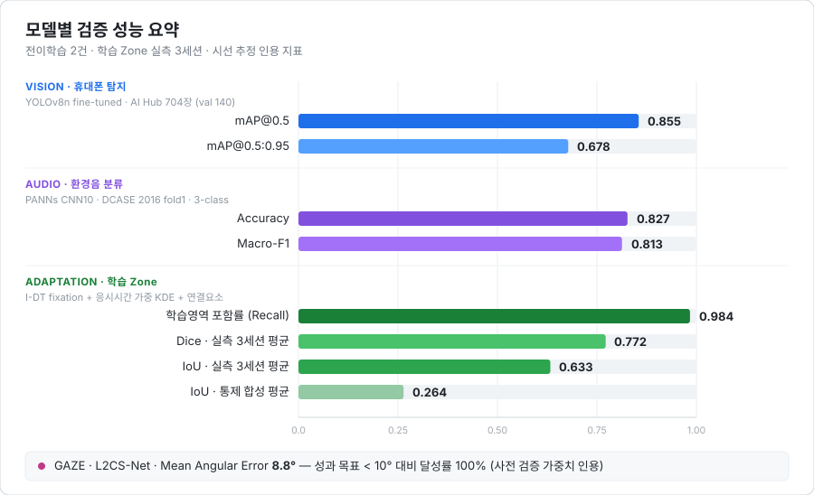
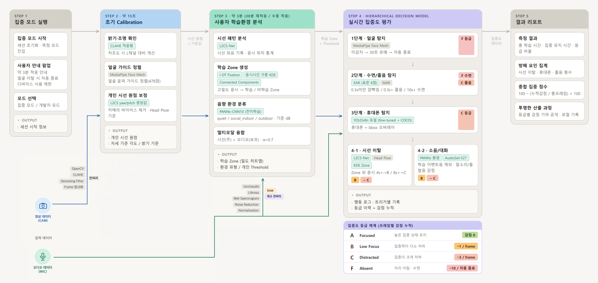
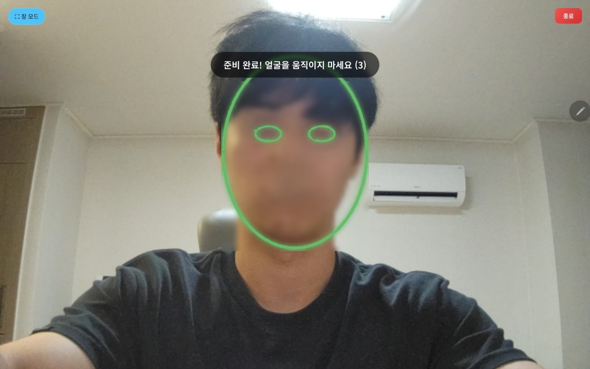
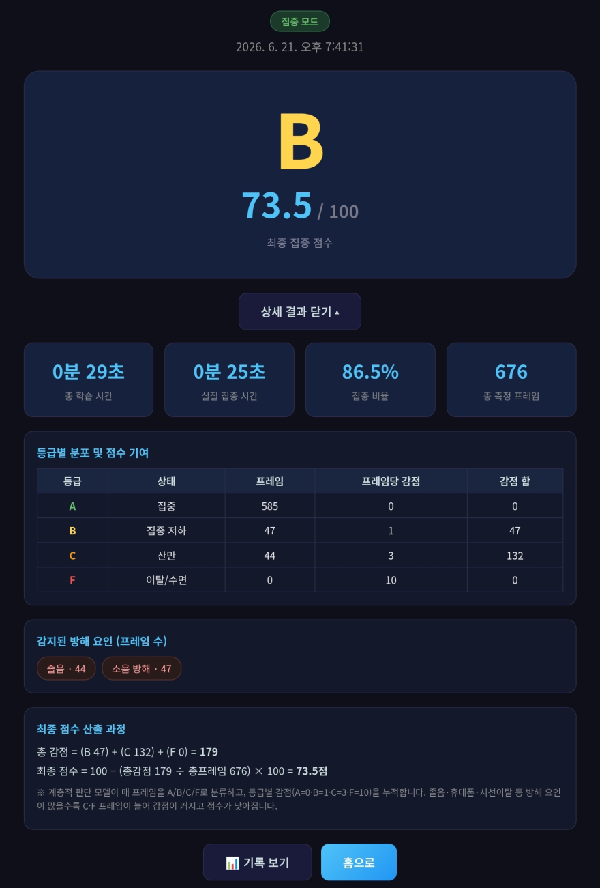
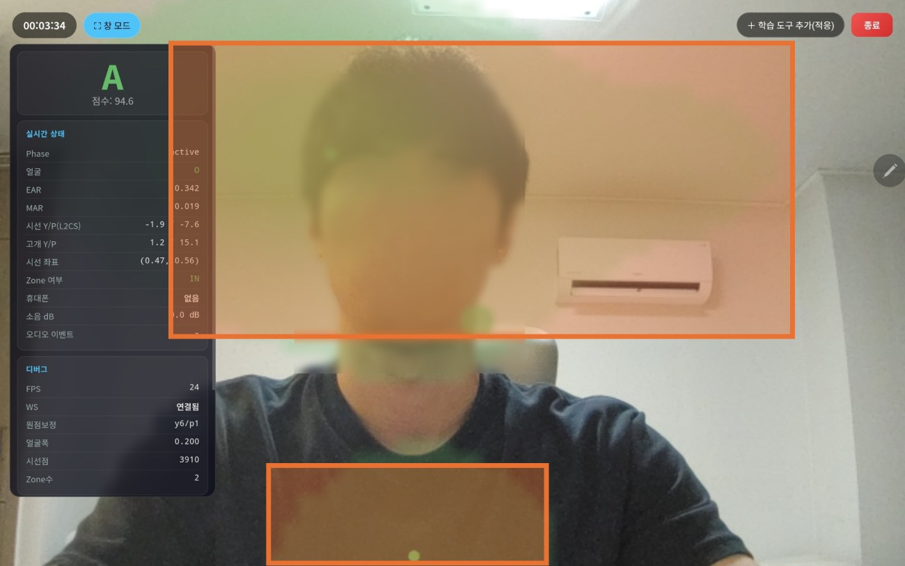
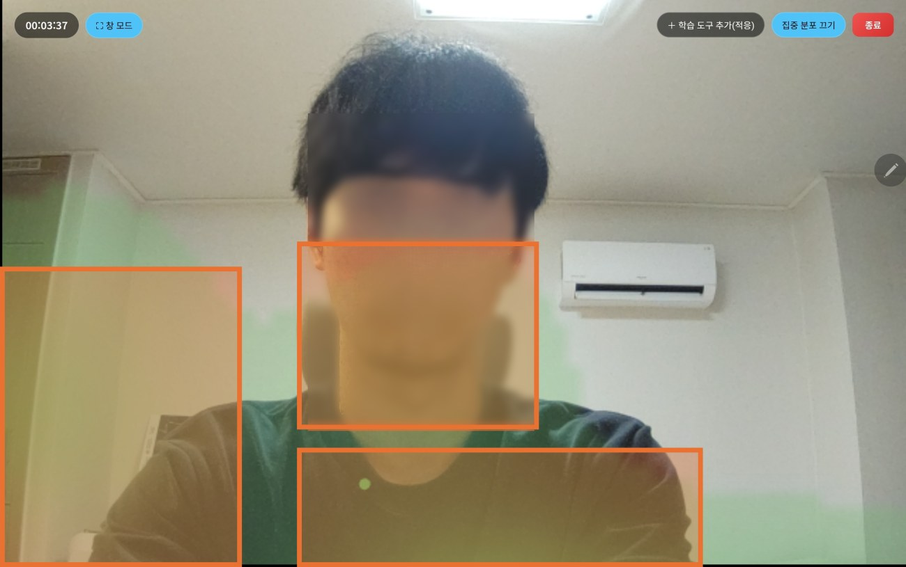
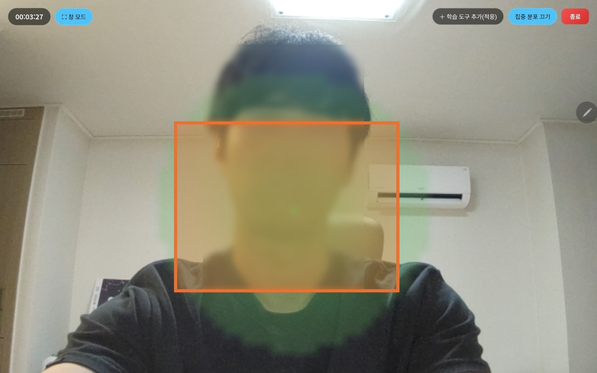

<div align="left">

# LEAM · Learning Environment Adaptive Model

**사용자의 학습 환경을 먼저 이해한 뒤, 개인화된 기준으로 집중도를 평가하는 멀티모달 AI 시스템**

웹캠과 마이크만으로 — 별도의 시선 추적 장비 없이 — 학습 중 집중 상태를 실시간 분석하고 정량화합니다.

[](https://www.python.org/)
[](https://pytorch.org/)
[](https://fastapi.tiangolo.com/)
[](https://github.com/ultralytics/ultralytics)
[](https://developers.google.com/mediapipe)

2026-1 딥러닝실습 기말 프로젝트 · 인공지능학과 김지오 · 1인 개발

</div>

---

## 개요

열품타 같은 학습 관리 앱은 **'앉아 있던 시간'**은 재지만 **'실제로 집중했는지'**는 모릅니다.
웹캠 기반 집중도 연구는 오래전부터 있었지만 대부분 **"정면을 응시하는가"** 라는 단일·고정 기준에 의존합니다.
그 결과 독서대에 책을 놓고 측면을 보는 사람, 노트에 필기하며 아래를 보는 사람은 전부 "집중하지 않음"으로 오판됩니다.

> **LEAM의 전제 — 집중도를 재기 전에, 이 사용자의 학습 환경부터 학습한다.**

세션 시작 직후 약 3분간 시스템은 **이 사용자가 실제로 어디를 오래 보는지**(학습 Zone)와
**이 공간이 얼마나 시끄러운지**(환경음 클래스·기준 dB)를 먼저 학습합니다.
이후 모든 집중도 판정은 이 **개인화된 기준선**에 대해 수행됩니다.
노트북만 보는 사용자와 독서대·책·강의화면을 오가는 사용자가 **같은 코드로, 서로 다른 기준으로** 평가됩니다.

### 기존 연구의 한계와 대응

| 기존 연구의 한계 | LEAM의 대응 |
|---|---|
| 디스플레이 중심 환경 전제 — 책·필기·독서대 등 학습의 다양성 미반영 | 응시 밀도 기반 **학습 Zone**으로 개인 학습 환경 자체를 학습 |
| 단일 지표 의존 — 시선이 아래로 향하면 '독서'와 '졸음'을 구분 못 함 | **계층적 판단 모델(4단계)** 로 방해 요인을 순차 검증 |
| 모든 사용자에 동일 임계값 — 일반화·신뢰성 한계 | 세션 시작 시 **캘리브레이션 + 환경 적응**으로 개인 기준선 수립 |
| 집중도의 이진화/단일 점수 — 행동의 복합성 미설명 | **A/B/C/F 4등급 + 감점 누적**으로 심각도를 반영해 정량화 |

### 핵심 성능

<div align="center">

</div>

| 구성 요소 | 지표 | 값 |
|---|---|---:|
| 휴대폰 탐지 (YOLOv8n 전이학습) | mAP@0.5 / mAP@0.5:0.95 | **0.855** / 0.678 |
| 환경음 분류 (PANNs CNN10 전이학습) | Accuracy / Macro-F1 | **0.827** / 0.813 |
| 학습 Zone 생성 (실측 3세션) | IoU / Dice / Recall | **0.633** / 0.772 / **0.984** |
| 시선 추정 (L2CS-Net, 인용) | Mean Angular Error | **8.8°** (목표 <10°) |
| **환경 적응 종합 `E_total`** | α=0.7 가중 결합 | **0.691** |

> **고지** — 시스템 수준 종합 성능(`rtC_total`)은 프레임 단위 정답 라벨링이 필요해 **측정하지 못했습니다**.
> 위 표는 구성 모델별 실측/인용 성능과 1인 3세션의 실측 Zone 평가입니다. 자세한 범위는 [성능 평가](#성능-평가) 참조.

<details>
<summary><b>English Summary</b></summary>

<br>

**LEAM** is a multimodal concentration-analysis system that **adapts to the learner's environment before scoring their focus**.

Conventional webcam-based attention systems apply one fixed threshold to everyone — typically "is the user looking
straight at the screen?" — which misclassifies readers using a book stand, note-takers, and anyone whose study tools
sit off-center. LEAM instead spends the first ~3 minutes learning *where this particular user actually looks* and
*how noisy their room is*, then evaluates every subsequent frame against that personalized baseline.

| | |
|---|---|
| **Input** | Ordinary webcam + microphone (no eye-tracker, no wearable) |
| **Vision** | MediaPipe Face Mesh (478 landmarks, client-side) · L2CS-Net gaze estimation · dual YOLOv8n phone detection |
| **Audio** | PANNs CNN10 — fine-tuned 3-class acoustic scene head + AudioSet-527 event head |
| **Adaptation** | I-DT fixation detection → duration-weighted KDE → connected components ⇒ personal "study zones" |
| **Decision** | 4-layer hierarchical decision model → per-frame grade A/B/C/F → cumulative penalty score |
| **Serving** | FastAPI + WebSocket hybrid: light features on the browser, GPU inference on the server |

**Measured results** — phone detection mAP@0.5 **0.855** · acoustic scene accuracy **0.827** / macro-F1 **0.813** ·
study-zone IoU **0.633** with recall **0.984** across 3 real sessions · gaze MAE **8.8°** (cited).

</details>

---

## 시스템 아키텍처

<div align="center">

</div>

단일 GPU(RTX 4060 8GB)에서 **세 개의 딥러닝 모델을 동시 가동하면서 실시간성을 유지**해야 했습니다.
그래서 연산을 클라이언트와 서버로 분담하는 하이브리드 구조를 택했습니다.

| | 담당 연산 | 전송 주기 |
|---|---|---|
| **클라이언트** (브라우저) | MediaPipe Face Mesh 478 랜드마크 → EAR/MAR/Head Pose, 히트맵·시선점·bbox 캔버스 렌더링 | — |
| **서버** (FastAPI + GPU) | L2CS-Net 시선 추정 | 얼굴 크롭 224px, **200 ms** |
| | YOLOv8n 듀얼 휴대폰 탐지 | 전체 프레임 640×480, **800 ms** |
| | PANNs CNN10 환경음·이벤트음 분류 | 16 kHz WAV, **~2 s** |
| | 계층적 판단 모델 → 등급/점수 | 특징값, **매 프레임** |

**기술 스택** — FastAPI · Uvicorn · websockets / PyTorch · torchvision · torchaudio / Ultralytics YOLOv8 /
MediaPipe Face Mesh / OpenCV(headless) · Pillow · NumPy · SciPy / SQLAlchemy(async) · aiosqlite · Pydantic /
HTML5 Canvas · WebRTC 기반 단일 페이지 프론트엔드

<details>
<summary><b>WebSocket 프로토콜 · 개발 환경</b></summary>

<br>

| 요청 `type` | 페이로드 | 응답 `type` |
|---|---|---|
| `features` | MediaPipe 특징(EAR/MAR/gaze/head) + dB + 휴대폰 확정 여부 | `concentration` (등급/점수) |
| `gaze` | 얼굴 크롭 base64 (224px JPEG) | `gaze_estimation` (yaw/pitch) |
| `frame` | 전체 프레임 base64 (640×480 JPEG) | `phone_detection` (검출/신뢰도/bbox) |
| `audio` | 누적 오디오 16 kHz WAV base64 | 환경 클래스 · 이벤트음 판정 |
| `readapt` | 수동 재적응 요청 | `phase_update` (adapting) |
| `phase_check` | 단계 전환 질의 | `phase_update` (현재 phase) |

**개발·테스트 환경** — Windows 11 · AMD Ryzen 5 7500F · 32 GB DDR5 · NVIDIA RTX 4060 (8 GB) ·
CUDA 12.4 (PyTorch 빌드) · Python 3.11 (conda 환경 `leam`)

</details>

---

## 동작 파이프라인

| 단계 | 소요 | 하는 일 | 산출물 |
|---|---|---|---|
| **1. 집중 모드 실행** | — | 디바이스 제한·적응 구간 미누적·자동 종료 조건 고지 후 모드 선택 | 세션 시작 |
| **2. 초기 Calibration** | ~15초 | 얼굴 가이드 정렬 → L2CS-Net yaw/pitch **중앙값**을 개인 '정면 원점'으로 확정 | 개인 시선 원점 · 자세 기준각 |
| **3. 학습환경 적응** | ~3분 | I-DT→KDE→연결요소로 학습 Zone 생성, PANNs로 환경 유형 분류 | 학습 Zone 마스크 · 기준 dB |
| **4. 실시간 집중도 평가** | 세션 전체 | 계층적 판단 모델이 매 프레임을 A/B/C/F로 분류 | 등급 이력 · 감점 누적 |
| **5. 결과 리포트** | — | 집중 시간·비율·등급 분포·트리거별 횟수·**감점 산출 전 과정** 제시 | localStorage 저장 |

**모드 분리** — *집중 모드*는 카메라를 화면 가득 채우고 실시간 수치를 숨깁니다. *개발자 모드*는 EAR/MAR/시선좌표/Zone 여부 등
모든 내부 지표를 실시간 현황판으로 노출합니다. 적응 단계는 30분마다 자동 반복되며, 학습 도구 배치를 바꾸면
`적응` 버튼으로 즉시 재적응할 수 있습니다(재적응 중 측정은 멈추지만 **누적 점수는 유지**).

<table>
<tr>
<td width="50%"></td>
<td width="50%"></td>
</tr>
<tr>
<td align="center"><sub><b>STEP 2</b> · 얼굴 가이드 정렬 후 개인 시선 원점 보정</sub></td>
<td align="center"><sub><b>STEP 5</b> · 등급별 감점 기여와 최종 점수 산출식을 그대로 공개</sub></td>
</tr>
</table>

---

## 핵심 알고리즘

### 학습 Zone 생성 — I-DT + KDE + 연결요소

이 프로젝트에서 가장 공들인 부분이자 LEAM이라는 이름의 근거입니다.
**"자주·오래 응시한 곳에 학습 대상이 존재한다"** 는 가정을 네 단계로 구현했습니다.

**① I-DT 응시 검출** — 시간순 시선 좌표열에서 연속 구간을 확장하며 분산이 임계값 이하로 유지되는 구간만
응시(fixation)로 인정하고, 빠르게 이동하는 saccade 좌표는 노이즈로 제거합니다.

```
dispersion = (max x − min x) + (max y − min y) ≤ 0.12   →  같은 fixation
조건: duration ≥ 0.10s  AND  points ≥ 2
```

**② 응시시간 가중 KDE** — 64×48 격자의 각 점에서, 모든 응시점에 지속시간 `d`를 가중치로 한 가우시안 커널을 누적합니다.

```
D(gx, gy) = Σₖ  dₖ · exp( −[(gx − x̄ₖ)² + (gy − ȳₖ)²] / (2σ²) )   ,  σ = 0.10
```

**③ 레벨셋 임계화** — 밀도를 내림차순 정렬한 누적합이 전체의 **92%**에 도달하는 지점의 밀도를 임계값 `τ`로 삼습니다.

**④ 연결요소 추출** — `scipy.ndimage.label`로 연결요소를 구하고, 5셀 미만 덩어리를 제거한 뒤 경계를 **5회 팽창**시켜
모니터 가장자리·키보드처럼 인접한 응시 영역까지 포용합니다.

> **왜 K-Means가 아닌가** — 중간 보고서 단계에서는 K-Means 군집화를 계획했지만 세 가지 문제가 있었습니다.
> ⑴ 사용자가 학습 도구를 몇 개 쓰는지 모르므로 **K를 미리 정할 수 없고**, ⑵ 군집이 원형/볼록으로 강제되어
> 가로로 긴 와이드 모니터나 얇은 키보드 띠 같은 **임의 형태를 못 담으며**, ⑶ **saccade 좌표가 군집을 오염**시킵니다.
> 위 조합은 Zone 개수가 연결요소 개수로 자동 결정되고, 임의 형태를 그대로 포착하며, I-DT가 saccade를 사전 제거합니다.
> 게다가 결과가 픽셀 마스크로 나오므로 IoU 평가와 히트맵 시각화에 그대로 쓸 수 있습니다.

→ [`backend/app/services/learning_zone.py`](backend/app/services/learning_zone.py)

### 계층적 판단 모델

단일 분류기로 한 번에 판정하는 대신, **판단 근거가 명확한 단서부터 순차 검사**합니다.
상위 계층일수록 오판 가능성이 낮으므로, 결정되면 하위 계층을 평가하지 않고 **즉시 반환(early return)** 합니다.

| 계층 | 판단 대상 | 근거 모델 | 판정 조건 (30 fps 기준) | 등급 |
|:--:|---|---|---|:--:|
| **1** | 얼굴 검출 (자리 이탈) | MediaPipe | 미검출 < 5s → 일시 손실 | C |
| | | | 미검출 ≥ 5s (150f) | **F** |
| | | | 미검출 ≥ 30s (900f) → 경고 후 자동 종료 | **F** |
| **2** | 졸음 / 수면 | EAR 수식 | EAR < 0.21 이 ≥ 0.3s (9f) | C |
| | | | EAR < 0.21 이 ≥ 10s (300f) | **F** |
| | 하품 | MAR 수식 | MAR > 0.6 이 ≥ 1.5s (45f) | B |
| **3** | 휴대폰 사용 | YOLOv8n 듀얼 | 확정 검출 시 (+ bbox 오버레이) | C |
| **4-1** | 시선 이탈 | L2CS-Net + KDE Zone | Zone 밖 응시 ≥ 4s (120f) | B |
| | | | Zone 밖 응시 ≥ 8s (240f) | C |
| **4-2** | 주변 소음 | PANNs + dB | 기준 dB 초과 또는 말소리 감지 | B |

Zone으로 돌아오면 누적 카운터를 프레임당 3씩 빠르게 감소시켜, 키보드를 보거나 필기하는 자연스러운 시선 이동을 오판하지 않습니다.

#### 등급 → 점수 정량화

각 등급에 심각도에 비례한 감점을 부여하고 전체 프레임에 걸쳐 누적합니다.

| 등급 | 상태 | 프레임당 감점 |
|:--:|---|--:|
| **A** | Focused · 집중 | 0 |
| **B** | Low Focus · 일시적 저하 | −1 |
| **C** | Distracted · 명확한 산만 | −3 |
| **F** | Absent · 자리 이탈 / 수면 | −10 |

```
최종 집중 점수 = max( 0 , 100 − (누적 감점 ÷ 전체 프레임 수) × 100 )
```

이 산출 과정은 **결과 화면에 그대로 노출**됩니다 — "B 47프레임 × 1 = 47, C 44프레임 × 3 = 132,
총 감점 179 ÷ 676프레임 → 73.5점". 점수의 근거를 사용자가 직접 검증할 수 있어야 한다는 판단이었습니다.

→ [`backend/app/services/concentration.py`](backend/app/services/concentration.py) — `evaluate()`

<details>
<summary><b>개인 시선 원점 보정 · 저조도 보정 · 임계값 결정 근거</b></summary>

<br>

**개인 시선 원점 보정** — 웹캠은 보통 눈높이보다 위에 있어 정면을 봐도 수직 편향이 생깁니다.
`calibrating` 단계에서 시선·고개 각도 표본의 **중앙값**을 개인 원점으로 확정합니다
(평균이 아닌 중앙값을 쓰는 이유는 깜빡임·미세 자세 변화 같은 순간적 이상치에 강건하기 때문).

```
yaw₀ = median(yawᵢ)   pitch₀ = median(pitchᵢ)   headPitch₀ = median(headPitchᵢ)

x = clip( 0.5 + yaw'/70 , 0, 1 )
y = clip( 0.5 − pitch'/(pitch' > 0 ? 22 : 36) + headPitch'/28 , 0, 1 )
```

상하 민감도가 비대칭인 이유(22 vs 36): L2CS-Net은 상방 시선에서 출력을 압축하는 경향이 있어 위쪽에 더 큰 민감도를
적용하고 고개 각도 항으로 보완했습니다. 이론에서 유도한 값이 아니라 **반복 실측으로 얻은 경험값**입니다.

**저조도 보정(CLAHE)** — 서버는 이미지를 LAB 색공간으로 변환해 **명도(L) 채널에만** CLAHE(`clipLimit=2.0`,
`tileGridSize=8×8`)를 적용합니다. 단 L 채널 평균 밝기가 **110 이상인 이미지는 보정을 건너뛰는 적응형 방식**이라,
정상 조명에서는 원본을 보존하고 저조도에서만 대비를 개선합니다. → [`backend/app/image_utils.py`](backend/app/image_utils.py)

**임계값 결정 근거**

| 파라미터 | 값 | 근거 |
|---|---:|---|
| `EAR_THRESHOLD` | 0.21 | 눈 뜬 상태 EAR ≈ 0.25~0.35, 감으면 ≤ 0.1 — MediaPipe 기반 졸음 탐지 구현체의 관행값 |
| 깜빡임 vs 졸음 | 0.3 s | 사람의 자발적 깜빡임은 약 0.1~0.4초 |
| `MAR_THRESHOLD` / 지속 | 0.6 / 1.5 s | 하품은 통상 1.5~2.5초간 입을 크게 벌림 — 발화·미소와 구분하기 위해 지속 조건 병행 |
| 캘리브레이션 길이 | 15 s | 시선 추정 초당 ~5회 → 약 75개 표본, 중앙값 추정에 충분 |
| 환경 적응 길이 | 180 s | I-DT 응시점 누적 + 단주기 소음 평균화를 위한 **예비값** (실험적 최적화 필요) |
| `KDE_BANDWIDTH` | 0.10 | L2CS-Net MAE 8.8° + 일반적 모니터 폭 → 측정 불확실성과 모니터 영역을 함께 포용하는 규모 |
| `MASS_COVERAGE` | 0.92 | 응시 분포 대부분 인정 + 극단적 이상치 제외 |
| `MASK_DILATION_ITERS` | 5 | 모니터 가장자리·키보드처럼 인접한 응시 흡수 |
| 시선 이탈 B / C | 4 s / 8 s | 학습 중 자연스러운 짧은 시선 이동을 집중 저하로 오판하지 않기 위해 관대하게 설정 |
| 휴대폰 신뢰도 (fine-tuned) | 0.65 | 소형 데이터 과적합으로 얼굴 등 오탐(최대 ≈0.56) → 임계값을 오탐 상한 위로 |
| 휴대폰 신뢰도 (COCO) | 0.40 | 오탐이 거의 없어 통상 임계값 사용 |

</details>

---

## 적용 모델과 전이학습

| 모델 | 역할 | 데이터 | 결과 |
|---|---|---|---|
| **L2CS-Net** (ResNet-50) | 시선 yaw/pitch 추정 | 사전 검증 가중치 인용 (2,558,104장) | MAE **8.8°** |
| **YOLOv8n 듀얼** | 휴대폰 탐지 | AI Hub Small object detection · 학습 564 / 검증 140 | mAP@0.5 **0.855** |
| **PANNs CNN10** | 환경음 · 이벤트음 분류 | DCASE 2016 fold1 · 학습 468 / 검증 156 | Acc **0.827** / F1 0.813 |

### 휴대폰 탐지 — 왜 듀얼 모델인가

증상이 **정반대 두 개**로 동시에 나타났습니다. 하나는 휴대폰이 없는데도 계속 검출되는 **오탐**이었고
(추적해보니 fine-tuned 모델이 얼굴을 휴대폰으로 오탐했고 그때 최대 신뢰도가 약 **0.56**),
다른 하나는 손에 들어 화면을 크게 차지하는 근거리 휴대폰을 못 잡는 **미탐**이었습니다.
미탐의 원인은 데이터에 있었습니다 — AI Hub 'Small object detection' 데이터는 이름 그대로
**휴대폰이 작게 보이는 소형 객체 위주**라 근거리 대형 휴대폰은 학습 분포 밖이었습니다.

해결은 두 갈래였습니다. 첫째, **비대칭 임계값** — 오탐 상한(0.56)보다 위인 **0.65**를 fine-tuned 모델에 설정하고,
오탐이 거의 없는 COCO 사전학습 모델은 통상값 **0.40**을 유지했습니다.
둘째, **듀얼 구조** — 두 모델을 병렬 실행해 하나라도 검출하면 검출로 처리(신뢰도는 max)하되,
fine-tuned는 원거리 소형, COCO는 근거리 대형을 담당하게 해 **학습 분포의 공백을 상호 보완**했습니다.
추가로 클라이언트에서 **최근 3회 중 2회 이상 검출될 때만 '확정'** 으로 처리하는 시간적 디바운스를 적용하고,
확정 시 **bbox를 화면에 오버레이**해 무엇이 휴대폰으로 인식됐는지 사용자가 직접 확인할 수 있게 했습니다.

### 환경음 분류 — 2축 구조

초기 오디오 판정은 **데시벨 단일 기준**이었고 명백히 실패했습니다.
**키보드를 치면서 코딩하면 계속 "집중 안 함"으로 판정**됐기 때문입니다.
타건음은 학습을 방해하는 소리가 아니라 **학습 행위 그 자체가 내는 소리**인데도 말입니다.
핵심 통찰은 소리의 **크기(dB)** 와 소리의 **의미(종류)** 가 다른 차원이라는 것이었습니다.

그래서 PANNs를 두 개의 헤드로 나눠 적재했습니다.

| 축 | 모델 | 역할 |
|---|---|---|
| **A · 환경 유형** | fine-tuned 3-class (512→128→3) | `quiet` / `social_indoor` / `outdoor` 분류 → **기준 데시벨 설정** |
| **B · 소리 종류** | AudioSet 527-class 사전학습 | 학습 이벤트음 vs 방해음 식별 → **실시간 방해 판정** |

| 분류 | AudioSet 클래스 (인정 확률 ≥ 0.10) | 처리 |
|---|---|---|
| 학습 이벤트음 | Typing · Typewriter · Computer keyboard · Writing · Clicking · Tap · Tick · Scratch(필기음) · Rustle · Crumpling(종이) · Scissors | **dB가 높아도 방해로 보지 않음** |
| 방해음 | Speech · Conversation · Narration · Hubbub · Shout / Scream · Siren류 · Alarm / Ringtone류 · Knock · Glass / Shatter | 등급 하향 |

축 A의 클래스별 성능은 아래와 같습니다.

| 클래스 | Precision | Recall | F1 |
|---|---:|---:|---:|
| quiet | 0.794 | 0.628 | 0.701 |
| social_indoor | 0.758 | 0.839 | 0.797 |
| outdoor | 0.917 | 0.965 | 0.940 |

> **오차 분석** — 성능 저하의 대부분은 `quiet` ↔ `social_indoor`(둘 다 실내) 사이에서 발생했습니다.
> 이는 **"실내가 조용한가"의 판단이 환경 유형 자체보다 실시간 말소리 유무에 더 의존**함을 보여줍니다.
> 이 오차 구조가 곧 2축 설계의 정당성입니다 — 환경 분류는 기준 소음 설정용으로만 쓰고,
> 실시간 방해 판정은 축 B의 말소리·돌발음으로 보강합니다.

<details>
<summary><b>전이학습 설정 및 학습 로그</b></summary>

<br>

**YOLOv8n (휴대폰)** — AI Hub 전자기기 49종 중 휴대폰만 추출해 단일 클래스 데이터셋 구성.
COCO 사전학습 yolov8n에서 백본 일부를 동결한 뒤 전이학습, patience 기반 조기 종료로 **29 에포크에서 종료**(best = epoch 19).

```
Starting training for 50 epochs...
      Epoch    GPU_mem   box_loss   cls_loss   dfl_loss  Instances       Size
       1/50      1.08G      1.073      3.436     0.9383          4        640
                   all        140        153    0.00321      0.882    0.00976     0.0057
       3/50      1.24G      1.128      1.917     0.9576          4        640
                   all        140        153      0.881      0.677      0.807      0.542
       5/50      1.24G      1.115      1.472     0.9646          4        640
                   all        140        153      0.846      0.804       0.87       0.63
……….(생략)……….
EarlyStopping: Training stopped early as no improvement observed in last 10 epochs.
Best results observed at epoch 19, best model saved as best.pt.

Model summary (fused): 73 layers, 3,005,843 parameters, 0 gradients, 8.1 GFLOPs
                   all        140        153      0.811      0.804      0.855      0.678
Speed: 0.2ms preprocess, 1.9ms inference, 0.0ms loss, 0.9ms postprocess per image
```

**PANNs CNN10 (환경음)** — DCASE 15개 장면 중 이동수단·순수 자연환경을 제외하고 학습 맥락에 맞춰 3클래스로 재매핑
(`quiet ← library, home` / `social_indoor ← cafe·restaurant, office, grocery store` / `outdoor ← city center, residential area, park`).
공식 fold1 분할(녹음 위치 기반, 데이터 누수 없음) 사용. AudioSet 사전학습 백본을 동결한 채 분류 헤드를 학습하다가
**10번째 에포크에서 마지막 두 합성곱 블록을 해제**하고 학습률을 1/10로 낮춰 미세조정. 클래스 불균형은 역빈도 가중치로 보정.

```
클래스별 학습 샘플 수: [113, 178, 177] → 가중치: [1.3805, 0.8764, 0.8814]

Epoch [1/30]  Loss: 1.0487  Train Acc: 0.4487  Val Acc: 0.2564   -> Saved best model
Epoch [3/30]  Loss: 0.7536  Train Acc: 0.6752  Val Acc: 0.7949   -> Saved best model
Epoch [6/30]  Loss: 0.6119  Train Acc: 0.7436  Val Acc: 0.8205   -> Saved best model
Epoch [10/30] Loss: 0.6231  Train Acc: 0.7158  Val Acc: 0.8526   -> Saved best model
Epoch 10: Unfreezing PANNs conv blocks for fine-tuning
Epoch [12/30] Loss: 0.5815  Train Acc: 0.7564  Val Acc: 0.8333
…..(생략)…..
Epoch [30/30] Loss: 0.5144  Train Acc: 0.7756  Val Acc: 0.8077

Training complete. Best Val Acc: 0.8526
```

**L2CS-Net (시선)** — 직접 학습하지 않고 '디스플레이 중심 안구 움직임 영상 데이터' 사업의 검증 가중치를 인용했습니다.
yaw·pitch 각 90 bin 분류 + 기댓값 기반 연속 각도, Epoch 100 / batch 16 / Adam / Early Stopping.

```
[---nia2022] Total Num:2500000, MAE:8.8372
```

</details>

---

## 성능 평가

LEAM은 **"환경을 이해하는 능력"** 과 **"집중을 판정하는 능력"** 이라는 성격이 다른 두 축을 갖습니다.
둘을 하나의 숫자로 합치면 어느 쪽이 부족한지 알 수 없으므로 **독립적으로 해석**하도록 설계했습니다.

```
E_total   = α · E_gaze + (1 − α) · E_audio                                ,  α = 0.7
rtC_total = β₁·P_face + β₂·P_drowsy + β₃·P_phone + β₄·P_gaze + β₅·P_noise ,  Σβ = 1
```

### 학습 Zone 실측 평가

직접 수행한 실제 학습 세션 3건을 개발자 모드로 캡처해, 시스템이 생성한 학습 Zone(주황 박스)과
실제 학습 대상 영역을 비교했습니다.

<table>
<tr>
<td width="33%"></td>
<td width="33%"></td>
<td width="33%"></td>
</tr>
<tr>
<td align="center"><sub><b>S1</b> 정면 모니터 + 키보드 → <b>2 Zone</b></sub></td>
<td align="center"><sub><b>S2</b> 좌측 독서대 + 하단 책 + 중앙 강의화면 → <b>3 Zone</b></sub></td>
<td align="center"><sub><b>S3</b> 단일 모니터 → <b>1 Zone</b></sub></td>
</tr>
</table>

| 실측 세션 | Zone 수 | IoU | Dice | 학습영역 포함률 (Recall) |
|---|:--:|---:|---:|---:|
| S1 정면 모니터 + 키보드 | 2 | 0.556 | 0.715 | 0.952 |
| **S2 독서대 + 책 + 강의화면** | **3** | **0.748** | **0.856** | **1.000** |
| S3 단일 모니터 | 1 | 0.594 | 0.745 | 1.000 |
| **평균** | — | **0.633** | **0.772** | **0.984** |

**세 세션 모두 학습 대상의 개수와 배치를 정확히 포착했습니다.**
특히 **S2**는 측면 독서대와 하단 책을 별도 Zone으로 분리했습니다 —
정면 응시만을 집중으로 보는 기존 방식과 달리 **측면·하단 학습도구를 정상 학습 영역으로 포용**하는
LEAM의 핵심 차별점을 실제 환경에서 입증한 사례입니다.

### 통제된 합성 평가

실측 표본 수의 한계를 보완하기 위해 대표 학습 환경을 모사한 합성 시선열로 동일 지표를 재현 가능하게 측정했습니다.
(→ [`backend/eval_zone_iou.py`](backend/eval_zone_iou.py))

| 합성 시나리오 | IoU | Dice | Recall |
|---|---:|---:|---:|
| 노트북 (중앙 모니터) | 0.233 | 0.378 | 1.000 |
| 독서대 (모니터 + 책) | 0.254 | 0.406 | 1.000 |
| 넓은 모니터 (가로 와이드) | 0.305 | 0.467 | 1.000 |
| **평균** | **0.264** | **0.417** | **1.000** |

합성 IoU가 실측보다 낮은 것은 합성 Ground Truth를 응시 지점에 **밀착해 좁게** 정의한 반면
시스템은 **의도한 여유 마진**(KDE bandwidth 0.10, 경계 팽창 5회)으로 Zone을 넓게 형성하기 때문입니다.
중요한 것은 **Recall이 모든 시나리오에서 1.000**이라는 점입니다 —
합성·실측 양쪽에서 **"실제 학습 시선을 놓치지 않는다"** 는 보수적 동작 특성이 일관되게 확인됩니다.
즉 LEAM의 학습 Zone은 정밀하게 좁히기보다 **거짓 이탈 경보를 줄이는 방향**으로 동작하며,
이는 버그가 아니라 의도적으로 선택한 트레이드오프입니다.

### 측정 범위와 미측정 항목

| 세부 기능 (계층) | 대표 지표 | 실측값 | 상태 |
|---|---|---:|---|
| ① 얼굴 검출 | 검출 신뢰도 | — | 검증된 사전모델(MediaPipe), 별도 정량셋 미측정 |
| ② 졸음/하품 | 임계 판정 | — | 규칙 기반, 별도 정량셋 미측정 |
| ③ 휴대폰 | mAP@0.5 | **0.855** | 실측 |
| ④-1 시선 이탈 | MAE (°) | **8.8°** | 인용 |
| ④-2 주변 소음 | Acc / Macro-F1 | **0.827 / 0.813** | 실측 |
| **시스템 종합 `rtC_total`** | 프레임별 등급 정확도 | — | **미측정** |

`rtC_total`을 산출하려면 사람이 세션 영상을 프레임 단위로 정답 라벨링한 검증 세트가 필요합니다.
다수 피실험자 섭외, 독서실·카페·강의실 등 다양한 환경 확보, 조명·카메라 위치·자세 등 실험 변수 통제가
학부 기말 과제의 시간·여건상 어려웠습니다.
**통제되지 않은 환경에서 얻은 값을 그럴듯하게 제시하는 것보다, 측정하지 못했다고 밝히는 편이 정직하다고 판단했습니다.**

<details>
<summary><b>가중치 α = 0.7 · β 결정 근거</b></summary>

<br>

**α = 0.7 (시선 0.7 / 오디오 0.3)**

1. **기능적 위계** — 시선 적응이 만드는 학습 Zone은 이후 모든 시선 이탈 판정의 **기준 좌표계**가 되어 계층 4-1을 직접
   좌우합니다. 반면 소음 적응은 기준 데시벨을 설정하는 **변조(modulation)** 역할에 그치며 상위 계층 판정에는 관여하지
   않습니다. 두 모달리티의 기여도는 대등하지 않습니다.
2. **설계 원칙과의 정합성** — 영상을 주 모달리티, 오디오를 보조 모달리티로 명시적으로 규정했습니다
   (무관한 말소리 효과 Irrelevant Speech Effect에 근거). 가중치는 이 원칙을 수치로 반영해야 합니다.
3. **후기 융합(late fusion)의 관례** — 멀티모달에서 보조 모달리티의 기여를 0.2~0.3 수준에 두는 것이 일반적입니다.
   보조 신호가 주 신호를 **보완하되 지배하지 않도록** 하기 위함입니다.

**β (계층 순위·신뢰도·집중과의 직접성 기준)**

| 세부 기능 | 등급 영향 | 신뢰도/결정성 | 가중치 |
|---|---|---|---:|
| 얼굴 탐지 (자리 이탈) | F (자동 종료) | 매우 높음 | β₁ = 0.25 |
| 졸음/수면 (EAR·MAR) | F / C / B | 높음 | β₂ = 0.25 |
| 휴대폰 탐지 | C | 중간 | β₃ = 0.20 |
| 시선 이탈 | B ~ C | 중간 | β₄ = 0.20 |
| 주변 소음 | B ~ C (보조) | 보조 | β₅ = 0.10 |

두 가중치 모두 **잠정적 설계값**입니다. 실사용자 데이터가 축적되면 실제 기여도를 반영해 재조정되어야 합니다.

</details>

---

## 시행착오 기록

중간 보고서(계획서)에서 최종 구현까지, 무엇이 깨졌고 왜 그렇게 고쳤는지의 기록입니다.

| # | 문제 상황 | 최초 접근 | 최종 해결 |
|:--:|---|---|---|
| 1 | 동공 위치만으로는 시선 각도가 불안정 | 동공 위치 휴리스틱 | **L2CS-Net** 학습 기반 시선 추정 (MAE 8.8°) |
| 2 | 학습 Zone 개수 K를 미리 알 수 없음 | K-Means 군집화 | **I-DT → KDE → 연결요소** (개수 자동 결정) |
| 3 | 웹캠이 눈높이 위 → 수직 시선 편향 | 보정 없음 | 캘리브레이션 **중앙값** 원점 + 상하 비대칭 민감도 |
| 4 | 휴대폰이 없는데 계속 탐지됨 (오탐) | 단일 fine-tuned 모델 | **비대칭 임계값(0.65/0.40) + 3회 중 2회 디바운스** |
| 5 | 손에 든 근거리 휴대폰은 미탐지 | 단일 fine-tuned 모델 | **COCO 사전학습 모델 병행 (듀얼 구조)** |
| 6 | 키보드만 쳐도 "집중 안 함"으로 판정 | 데시벨 단일 기준 | **AudioSet 527클래스 이벤트음 축(축 B) 추가** |
| 7 | 모니터 가장자리·키보드를 봐도 시선 이탈 | 좁은 Zone 마스크 | **KDE bandwidth 0.10 + 경계 팽창 5회** |
| 8 | 저조도에서 랜드마크·탐지 불안정 | 보정 없음 | **적응형 CLAHE** (L채널, 밝기 110 이상은 스킵) |
| 9 | 성능 가중치 α, β가 전부 "추후 결정" | 공식만 제시 | **α=0.7 · β 5개 확정 + 근거 3가지 문서화** |
| 10 | 실측 표본 부족 → 평가 신뢰성 미확보 | 실측만 계획 | **통제 합성 + 실측 하이브리드 평가** |
| 11 | "B등급 X회"만 보여줘 사용자가 납득 못 함 | 최종 점수만 표시 | **감점 산출 전 과정 + 트리거별 횟수 공개** |
| 12 | 얼굴 가이드가 너무 가까워 실사용과 괴리 | 큰 얼굴 윤곽선 | **기존 크기의 65%로 축소** |
| 13 | React SPA 라우팅이 실시간 파이프라인에 과함 | Vite + React 다중 페이지 | **단일 HTML SPA로 통합** (`static/index.html`) |

<details>
<summary><b>특히 오래 걸린 세 가지 — 상세</b></summary>

<br>

**⑨ "추후 결정"으로 남겨둔 가중치를 끝까지 밀어붙인 일**

중간 보고서에서 종합 성능 공식을 제시했지만 **핵심 가중치 α와 β₁~β₅가 전부 "추후 결정"** 상태였습니다.
공식만 있고 실질적 수치 기준이 없으니 **평가 체계가 선언에 그치는** 상황이었습니다.
임의의 숫자를 넣는 것은 쉽지만 그건 근거가 아닙니다. 그래서 각 가중치에 **왜 그 값인지 설명 가능한 근거**를
찾아 붙이는 작업을 별도로 진행했습니다. 이 과정에서 배운 것은
**실험 설계 방법론이야말로 AI 모델의 신뢰도를 결정한다**는 것이었습니다.
모델을 잘 만드는 것과, 그 모델이 얼마나 좋은지를 **설득력 있게 측정하는 것**은 별개의 역량입니다.

**⑩⑪ 평가의 정직성과 결과의 투명성**

실측만으로는 표본이 3세션뿐이라 통계적 의미가 약하고, 합성만으로는 현실성이 없어 **둘 다 제시**하는 방식을 택했습니다.
합성 IoU(0.264)가 실측(0.633)보다 낮게 나온 것도 숨기지 않고 **왜 그런지**를 설명했습니다.
불리한 숫자를 감추는 것보다 그 숫자가 나온 이유를 설명하는 편이 시스템을 더 잘 설명한다고 판단했습니다.

결과 화면도 마찬가지였습니다. 초기에는 "B등급 47회, C등급 44회, 최종 73.5점"만 보여줬는데,
사용자 입장에서는 **왜 그 점수인지 알 수 없어 납득이 되지 않습니다.**
계층적 판단 모델을 만들어 놓고 그 판단 과정을 감추는 것은 모순이기도 했습니다.
그래서 등급별 프레임 수 × 감점 = 감점 합, 트리거별 감지 횟수, 최종 산식까지 전부 공개하도록 재설계했습니다.

**⑬ React SPA → 단일 HTML 통합**

초기에는 Vite + React + react-router로 4개 라우트를 구성할 계획이었습니다. 진행하면서 이 구조가 과하다고 판단했습니다 —
실시간 파이프라인의 핵심은 **비디오 프레임 → 캔버스 → WebSocket**이라 React 렌더 사이클과 잘 맞지 않았고,
라우트 전환마다 카메라·WebSocket·MediaPipe 인스턴스의 생명주기를 다시 관리해야 했으며,
단일 GPU 서버 하나로 전부 서빙하는 구조에서 프론트엔드를 별도 배포할 이유가 없었습니다.
최종적으로 **FastAPI가 서빙하는 단일 HTML SPA**(592줄)로 모드 선택·세션·결과·기록 4개 화면을 모두 구현했습니다.
`frontend/` 디렉터리는 **초기 프로토타입의 흔적**으로 남아 있으며 현재는 빌드되지 않습니다.

</details>

---

## 실행 방법

Python 3.11(conda 권장), 웹캠 + 마이크가 필요합니다. CUDA GPU는 선택이지만 없으면 실시간성이 떨어집니다.

> **가중치 파일은 저장소에 포함되어 있지 않습니다** (`backend/weights/`는 `.gitignore` 처리).
> `l2cs_net.pkl`, `panns_cnn10_pretrained.pth`는 각 프로젝트의 사전학습 가중치를,
> `yolov8n_phone.pt`, `panns_cnn10.pth`는 아래 전이학습 스크립트로 직접 생성해야 합니다.

```bash
conda create -n leam python=3.11 -y && conda activate leam
```

```bash
pip install -r backend/requirements.txt
```

```bash
python backend/run.py
```

브라우저에서 **http://localhost:8000** 접속 → `집중 모드` 또는 `개발자 모드` 선택.

<details>
<summary><b>Docker · 전이학습 재현 · 성능 평가</b></summary>

<br>

**Docker**

```bash
docker build -t leam-api ./backend && docker run -p 8000:8000 leam-api
```

**휴대폰 탐지 전이학습** — AI Hub [Small object detection을 위한 이미지 데이터](https://aihub.or.kr/aihubdata/data/view.do?dataSetSn=476) 필요

```bash
python backend/training/prepare_phone.py && python backend/training/train_phone_detector.py
```

**환경음 분류 전이학습** — [DCASE 2016 TUT Acoustic Scenes](https://dcase.community/challenge2016/task-acoustic-scene-classification) 필요

```bash
python backend/training/prepare_dcase.py && python backend/training/train_audio_classifier.py
```

**성능 평가**

```bash
python backend/evaluation/eval_all.py
```

</details>

---

## 프로젝트 구조

```
backend/
├─ run.py                       # 개발 서버 실행 진입점
├─ app/
│  ├─ main.py                   # FastAPI 앱 · lifespan · 모델 로드
│  ├─ config.py                 # 임계값 · 단계 시간 등 전역 설정
│  ├─ image_utils.py            # 적응형 CLAHE 저조도 보정
│  ├─ models/                   # gaze_estimator · phone_detector · audio_classifier · panns_model
│  ├─ services/
│  │  ├─ session_manager.py     #   세션 생명주기 · 단계 전환 · 재적응
│  │  ├─ concentration.py       #   계층적 판단 모델 · 등급/감점 산정
│  │  └─ learning_zone.py       #   I-DT + KDE 학습 Zone 생성
│  ├─ routers/ schemas/ database/
│  └─ static/index.html         # 단일 페이지 프론트엔드 (실제 데모 UI)
├─ training/                    # 전이학습 · 데이터 변환 스크립트
├─ evaluation/                  # 계층별 성능 평가 스크립트
└─ weights/                     # 학습된 가중치 (gitignored)

frontend/                       # Vite + React 초기 프로토타입 (현재 미빌드)
docs/images/                    # README 이미지 자산
```

---

## 한계와 향후 과제

| 한계 | 향후 방향 |
|---|---|
| **휴대폰 탐지의 사각지대** — 카메라가 책상 아래·화각 밖을 비추지 못해 회피가 구조적으로 가능 | 다중 카메라, 손 동작 추정, 시선·자세의 간접 단서 결합 |
| **의미 있는 말소리의 양면성** — 인강을 스피커로 듣거나 영어 단어를 소리 내어 외우는 경우는 오히려 학습 행위 | LLM/상황 인식 모델로 "이 소리가 학습에 도움인지 방해인지" 맥락 판단 |
| **정적 학습 Zone** — 도구 배치 변경 시 사용자가 직접 `적응` 버튼을 눌러야 함 | AI가 배치 변화를 스스로 감지해 Zone을 동적 재구성 |
| **수치 중심 리포트** — 등급·점수만으로는 행동 개선 지침이 되기 어려움 | LLM 기반 자연어 피드백 리포트 |
| **이어폰·귀마개 Edge Case** — 노이즈 캔슬링·음악 청취 여부는 외부 관측으로 판단 곤란 | 별도 검토 필요 |
| **학습 이벤트음의 근사 매핑** — AudioSet에 볼펜·형광펜 등 미세 분류 없음 | 맥락 인식과 결합, 실사용 데이터로 검증·보정 |
| **`rtC_total` 미측정** — 프레임 단위 정답 라벨링 세트 부재 | 피실험자 확보 → 프레임 라벨링 → 계층별 성능 + `rtC_total` 실측 |
| **적응 시간 3분의 근거 부족** — 카페처럼 가변 소음 환경에서 대표성 부족 가능 | 환경별 최적 적응 시간 실험 |

---

## 사용 데이터셋 및 참고문헌

| 데이터셋 | 용도 | 사용 범위 |
|---|---|---|
| [AI Hub — Small object detection](https://aihub.or.kr/aihubdata/data/view.do?dataSetSn=476) | 휴대폰 탐지 전이학습 | 전자기기 49종 중 `cell_phone` 단일 클래스 · 학습 564 / 검증 140 |
| [DCASE 2016 — TUT Acoustic Scenes](https://dcase.community/challenge2016/task-acoustic-scene-classification) | 환경음 분류 전이학습 | 15개 장면 → 3클래스 재매핑 · 공식 fold1 · 학습 468 / 검증 156 |

두 데이터셋 모두 공개/오픈 데이터이며, 용량 문제로 저장소에는 포함하지 않았습니다.

<details>
<summary><b>참고문헌 (17건)</b></summary>

<br>

[1] '남이 봐야 공부 잘 된다?'…캠스터디 열풍, AI Times<br>
[2] Robal, T., Zhao, Y., Lofi, C., & Hauff, C. (2018). *Webcam-based attention tracking in online learning: A feasibility study.* IUI 2018, 189–197.<br>
[3] Hutt, S., Wong, A., Papoutsaki, A. et al. (2024). *Webcam-based eye tracking to detect mind wandering and comprehension errors.* Behavior Research Methods, 56, 1–17.<br>
[4] 서정민, 박상근. (2024). 시선 트래킹 기반 이러닝 집중도 측정 시스템. 한국정보과학회 학술발표논문집.<br>
[5] 김회민, 전성국, 김운용, 윤정록. (2022). 한국정보처리학회 추계학술발표대회, 275–276.<br>
[6] 이문환, 이혁민, 정성택. (2021). 학습자 히스토리를 활용한 녹화 영상 기반 수업 지원 시스템. Archives of Design Research, 34(4), 225–239.<br>
[7] Tobii. https://www.tobii.com/ <br>
[8] 이동원, 박상인, 황민철. (2018). 심전도를 이용한 집중도 인식 방법. 한국콘텐츠학회 논문지, 18(2), 370–377.<br>
[9] Irrelevant speech effect. Wikipedia.<br>
[10] Small object detection을 위한 이미지 데이터. AI Hub (dataSetSn=476).<br>
[11] DCASE 2016 — TUT Acoustic Scenes 2016.<br>
[12] Drowsiness-Detection-Mediapipe. GitHub (Tandon-A).<br>
[13] Driver Drowsiness Detection Using Mediapipe. LearnOpenCV.<br>
[14] Abdelrahman, A. A. et al. (2022). *L2CS-Net: Fine-Grained Gaze Estimation in Unconstrained Environments.*<br>
[15] Kong, Q. et al. (2020). *PANNs: Large-Scale Pretrained Audio Neural Networks for Audio Pattern Recognition.* IEEE/ACM TASLP.<br>
[16] Jocher, G. et al. *Ultralytics YOLOv8.*<br>
[17] 디스플레이 중심 안구 움직임 영상 데이터 — AI 모델 테스트 결과서. 2022.

</details>
